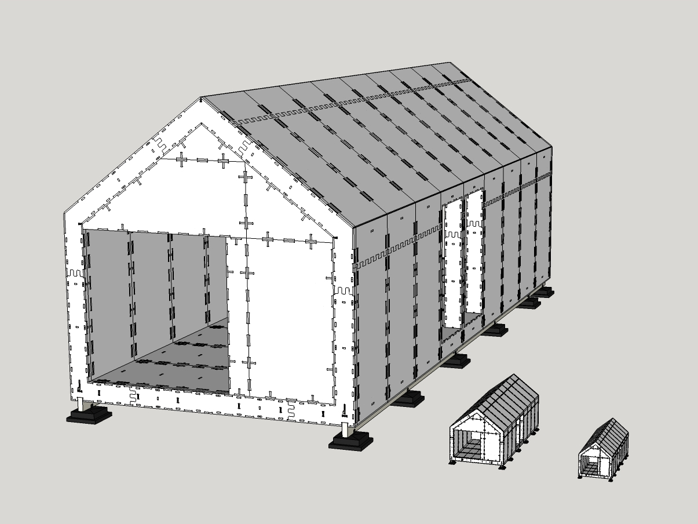

# Wikihouse Scale Models

This is a repo for scaled models of the Wikihouse WREN chassis. These are ideal for creating demo models, education, or practicing a build.

| Scale     | Material      | Thickness     | Tool          | Approx size   |
|-----------|---------------|---------------|---------------|---------------|
| 1:1       | Plywood       | 20mm          | CNC           | Small house   |
| 1:6       | Plywood       | 3mm           | Laser cutter  | Dog kennel    |
| 1:10      | MDF           | 2mm           | Laser cutter  | Dolls house   |

